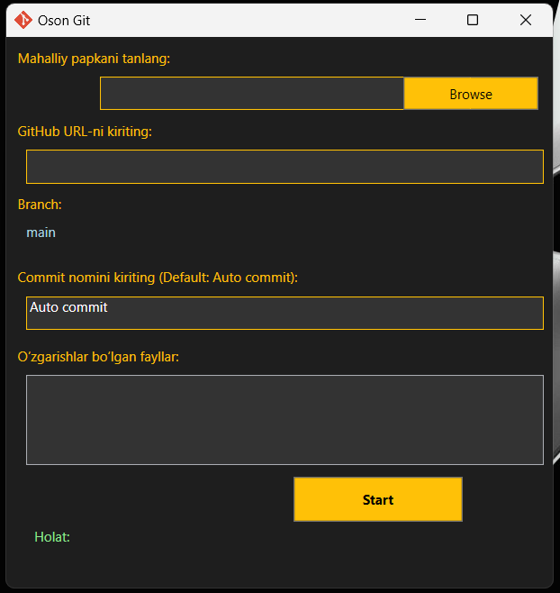

# Oson Git

<a href="https://github.com/jasurhaydarovcode/Oson-Git/releases/download/YuklabOlish/Oson.Git.Setup.rar">Yuklab Olish OsonGitSetup.zip</a>

Oson Git – bu **Windows** uchun qulay **Git boshqaruv dasturi** bo‘lib, foydalanuvchilarga GitHub bilan ishlashni osonlashtiradi. Dastur orqali **mahalliy papkani tanlash**, **GitHub'ga ulanish**, **commit qilish** va **o‘zgarishlarni kuzatish** mumkin.

## 📌 Xususiyatlar
- 📂 **Mahalliy papkani tanlash** – Foydalanuvchi lokal loyiha papkasini tanlashi mumkin.
- 🔗 **GitHub bilan ulanish** – GitHub repository URL kiritish orqali bog‘lanish.
- 🔄 **O‘zgarishlarni kuzatish** – O‘zgargan fayllarni real vaqt rejimida ko‘rish.
- 📝 **Commit yaratish** – Maxsus commit xabari bilan o‘zgarishlarni GitHub'ga yuklash.
- 🚀 **Branch nomini avtomatik aniqlash** – Loyihaning qaysi branchda ishlayotganini ko‘rsatadi.

## 🛠 O‘rnatish

1. **Oson Git dasturini yuklab oling**: 
   ```plaintext
   https://github.com/jasurhaydarovcode/Oson-Git/releases/download/YuklabOlish/Oson.Git.Setup.rar
   ```
2. `.exe` faylni ishga tushiring va o‘rnatish jarayonini yakunlang.
3. Dastur ochilgandan so‘ng, lokal papkani tanlang va GitHub URL kiritib ishlashni boshlang!

## 🔧 Ishlatish

1️⃣ **Mahalliy loyihangiz papkasini tanlang.**  
2️⃣ **GitHub repository URL manzilini kiriting.**  
3️⃣ **Commit xabarini yozing yoki standart "Auto commit" dan foydalaning.**  
4️⃣ **Start tugmachasini bosib, GitHub'ga yuklang.**

## 📷 Screenshot


## 📢 Muallif
**Jasur Haydarov**  
💻 GitHub: [github.com/jasurhaydarovcode](https://github.com/jasurhaydarovcode)

## 📜 Litsenziya
MIT Litsenziyasi asosida tarqatiladi. Qo‘shimcha ma’lumot uchun `LICENSE` faylini ko‘rib chiqing.
